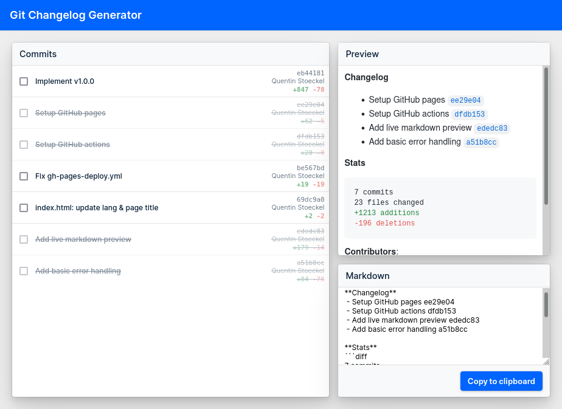

# Git Changelog Generator

Generate fancy tech-oriented changelogs from [any git patch](https://github.com/MesaVolt/git-changelog-generator/compare/81207cb2c0d95405e9ea68950a54468ae02a3725...a51b8cc9b3590c0e9f2df256abaa07a2ac0405cf.patch):



> **Changelog**
>- Setup GitHub pages ee29e04
>- Setup GitHub actions dfdb153
>- Add live markdown preview ededc83
>- Add basic error handling a51b8cc
>
>**Stats**
>```diff
>7 commits
>23 files changed
>+1213 additions
>-196 deletions
>```
>
>**Contributors**:
>- Quentin Stoeckel <stoeckel.quentin@gmail.com> - 7 commits

**[Try it live](https://mesavolt.github.io/git-changelog-generator/)**

## Development

## Project setup
```
yarn install
```

### Compiles and hot-reloads for development
```
yarn serve
```

### Compiles and minifies for production
```
yarn build
```

### Lints and fixes files
```
yarn lint
```

### Customize configuration
See [Configuration Reference](https://cli.vuejs.org/config/).
